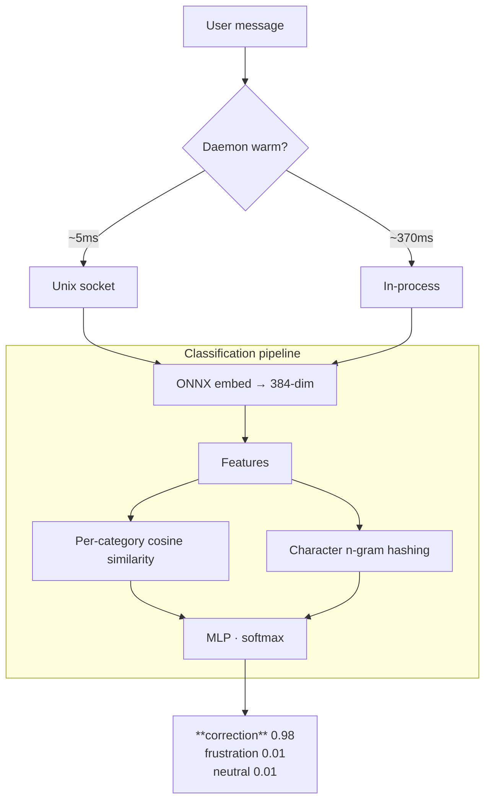

# Computer Says No (`csn`)

Detect user intent in under 5ms. A single binary that classifies text against customizable phrase sets — built for agent hooks that need to steer behavior without calling an LLM.

## Why csn

**The problem**: Your agent needs to know *how* the user feels about its work — are they correcting it, frustrated with it, or happy? You could prompt an LLM to classify every message, but that's slow, expensive, and overkill for pattern matching.

**csn solves this**: Embed text locally, compare against curated phrase sets, and get a category + confidence score in milliseconds. No prompts, no tokens, no latency — just a function call that returns `{"category": "frustration", "confidence": 0.93}`.

| Feature | Detail |
|---------|--------|
| **~5ms classification** | Background daemon keeps the model warm via unix socket |
| **Typo-robust** | Character n-gram features handle "wtf", "wft", "wttf" the same way |
| **Per-category scores** | Softmax MLP gives probability distribution, not just match/no-match |
| **Single binary** | `cargo install computer-says-no` — no Python, no Docker, no model servers |
| **Customizable** | Define your own categories in TOML. Ship corrections/frustration/neutral out of the box |
| **Agent-agnostic** | Works with any agent that supports hooks — Claude Code, Cursor, Windsurf, Codex, or your own |

## Quick start

```fish
cargo install computer-says-no

csn classify "what the fuck" --set corrections --json
# → {"category": "frustration", "confidence": 0.93, ...}

csn classify "wrong file" --set corrections --json
# → {"category": "correction", "confidence": 0.98, ...}

csn classify "sounds good" --set corrections --json
# → {"category": "neutral", "confidence": 0.70, ...}
```

First call downloads the ONNX model + trains the MLP (~10s). After that: ~5ms via background daemon.

## Installation

### Quick install (recommended)

```bash
curl -fsSL https://raw.githubusercontent.com/srobroek/computer-says-no/main/install.sh | bash
```

Installs the `csn` binary via `cargo install` and downloads the default reference sets. Requires Rust 1.92+.

### Manual install

```fish
cargo install computer-says-no
```

Then download reference sets (see [Reference set locations](#reference-set-locations)).

### From GitHub releases

Download a precompiled binary for your platform from [Releases](https://github.com/srobroek/computer-says-no/releases).

### From source

```fish
git clone https://github.com/srobroek/computer-says-no.git
cd computer-says-no
cargo build --release
```

### Verify

```fish
csn classify "test" --set corrections --json
```

## Architecture



### Components

- **CLI**: `csn classify`, `csn embed`, `csn similarity` — auto-route through daemon when warm
- **MCP server**: `csn mcp` — stdio transport, 4 tools (classify, list_sets, embed, similarity)
- **Daemon**: Lazy background process that keeps the embedding model and MLP weights in memory

### How the daemon works

The daemon is transparent — you never start or manage it manually.

1. **First CLI call**: `csn classify` checks for a unix socket at `~/.cache/computer-says-no/csn.sock`
2. **No socket found**: Spawns `csn daemon` as a detached background process, which loads the embedding model, trains/loads MLP weights, and listens on the socket
3. **Socket found**: Sends the classify request over the socket, gets a response in ~5ms
4. **Idle timeout**: After 5 minutes of no requests (configurable via `CSN_IDLE_TIMEOUT`), the daemon exits and cleans up its socket/PID files
5. **Next CLI call**: Cycle repeats — daemon restarts on demand

The MCP server (`csn mcp`) is separate — it runs over stdio and is managed by your MCP client (Claude Code, Cursor, etc.). It does NOT use the daemon.

## Hook setup

Hooks let your agent automatically detect and respond to user corrections, frustration, or any custom signal. See [Installation](#installation) first.

### Integration

The core pattern: pipe the user message through `csn classify --json`, check the category, and inject context into the agent.

<details>
<summary><strong>Claude Code</strong></summary>

```bash
mkdir -p .claude/hooks
curl -fsSL -o .claude/hooks/user-frustration-check.sh \
  https://raw.githubusercontent.com/srobroek/computer-says-no/main/.claude/hooks/user-frustration-check.sh
chmod +x .claude/hooks/user-frustration-check.sh
```

Add to `.claude/settings.json`:

```json
{
  "hooks": {
    "UserPromptSubmit": [
      {
        "hooks": [
          {
            "type": "command",
            "command": ".claude/hooks/user-frustration-check.sh",
            "timeout": 5
          }
        ]
      }
    ]
  }
}
```
</details>

<details>
<summary><strong>Cursor</strong></summary>

Add a rule in `.cursorrules` that invokes csn:

```
Before responding to user messages, classify the input:
Run: csn classify "<user_message>" --set corrections --json
If category is "correction": acknowledge the mistake and adjust.
If category is "frustration": reflect on what went wrong, de-escalate.
```

Or use csn as an MCP server in Cursor's MCP config for tool-based classification.
</details>

<details>
<summary><strong>Any agent with shell hooks</strong></summary>

```bash
#!/usr/bin/env bash
USER_MESSAGE="$1"
RESULT=$(csn classify "$USER_MESSAGE" --set corrections --json 2>/dev/null)
CATEGORY=$(echo "$RESULT" | jq -r '.category // empty')

case "$CATEGORY" in
  correction) echo "User is correcting you. Acknowledge and fix." ;;
  frustration) echo "User is frustrated. Reflect on what went wrong." ;;
  *) ;; # neutral — no action
esac
```

Adapt the output format to your agent's hook protocol.
</details>

### Configure threshold

Default: 60% confidence (tuned for multi-category where softmax distributes probability across categories):

```bash
export CSN_FRUSTRATION_THRESHOLD=0.50  # more sensitive
export CSN_FRUSTRATION_THRESHOLD=0.80  # less sensitive
```

### What the hook detects

| Category | Examples | Suggested behavior |
|----------|----------|--------------------|
| **Correction** | "wrong file", "revert that", "not what I asked" | Acknowledge mistake, confirm understanding, adjust |
| **Frustration** | "wtf", "are you kidding me", "I give up" | Reflect on what went wrong, de-escalate, save lesson |
| **Neutral** | "sounds good", "add error handling", "how does this work?" | No action needed |

## Reference sets

Reference sets are TOML files that define classification patterns. `csn` ships with a `corrections` set (1600+ phrases for correction/frustration/neutral detection).

### Reference set locations

`csn` searches for reference sets in this order:

| Priority | Location | When to use |
|----------|----------|-------------|
| 1 | `--sets-dir` CLI flag | One-off testing |
| 2 | `CSN_SETS_DIR` env var | CI, hooks |
| 3 | `sets_dir` in config.toml | Permanent override |
| 4 | Platform config dir (default) | Normal use |
| 5 | Next to the binary | GitHub release downloads |
| 6 | `./reference-sets/` in CWD | Development (source builds) |

**Platform config directories** (via the `directories` crate):

| Platform | Path |
|----------|------|
| macOS | `~/Library/Application Support/computer-says-no/reference-sets/` |
| Linux | `~/.config/computer-says-no/reference-sets/` |
| Windows | `%APPDATA%\computer-says-no\reference-sets\` |

The install script handles this automatically. For manual setup:

```fish
# macOS
mkdir -p ~/Library/Application\ Support/computer-says-no/reference-sets
curl -fsSL -o ~/Library/Application\ Support/computer-says-no/reference-sets/corrections.toml \
  https://raw.githubusercontent.com/srobroek/computer-says-no/main/reference-sets/corrections.toml

# Linux
mkdir -p ~/.config/computer-says-no/reference-sets
curl -fsSL -o ~/.config/computer-says-no/reference-sets/corrections.toml \
  https://raw.githubusercontent.com/srobroek/computer-says-no/main/reference-sets/corrections.toml
```

### Creating a reference set

Create a `.toml` file in your reference sets directory:

**Multi-category (recommended)**:

```toml
[metadata]
name = "my-classifier"
description = "Classify text into categories"
mode = "multi-category"
threshold = 0.5

[categories.positive]
phrases = ["example positive 1", "example positive 2"]

[categories.negative]
phrases = ["example negative 1", "example negative 2"]

[categories.neutral]
phrases = ["neutral phrase 1", "neutral phrase 2"]
```

**Binary (simpler, for yes/no classification)**:

```toml
[metadata]
name = "my-pattern"
mode = "binary"
threshold = 0.5

[phrases]
positive = ["phrases that should match"]
negative = ["phrases that should NOT match"]
```

Classify against it: `csn classify "test" --set my-classifier --json`. The MLP trains automatically on first use and caches weights.

### Minimum requirements

- Multi-category: 2+ phrases per category, 4+ total
- Binary: 1+ positive phrase (negatives optional but improve accuracy)

### Tips for effective reference sets

- **More phrases = better accuracy.** Aim for 50+ per category. The shipped `corrections` set has ~500 per category.
- **Include near-misses.** "holy shit that's amazing" in neutral helps the MLP distinguish it from "holy shit you broke everything" in frustration.
- **Cover vocabulary range.** Include formal ("that is incorrect"), informal ("nah"), profane ("wtf"), and abbreviated ("no") variants.
- **Use intent for boundaries.** Correction = directive ("wrong file"). Frustration = emotional ("I give up"). Sarcasm = classify by the underlying intent.

### Dataset ideas

| Use case | Categories |
|----------|-----------|
| Agent corrections/frustration | `correction`, `frustration`, `neutral` (shipped) |
| Customer support triage | `urgent`, `complaint`, `question`, `feedback` |
| Code review signals | `bug`, `style`, `security`, `praise`, `question` |
| Meeting intent | `action_item`, `decision`, `question`, `aside` |
| Sentiment | `positive`, `negative` (binary) |
| Sales signals | `interest`, `objection`, `question`, `ready_to_buy` |
| Content moderation | `toxic`, `spam`, `off_topic`, `acceptable` |

## Benchmarks

Run benchmarks yourself:

```fish
csn benchmark run                              # all 12 models
csn benchmark run --model bge-small-en-v1.5-Q  # specific model
csn benchmark run --json --output results.json # save for comparison
csn benchmark run --compare old-results.json   # diff against previous
```

Results on the shipped `corrections` dataset (62 prompts, 3 categories):

| Model | Accuracy | p50 (ms) | Cold start | Notes |
|-------|----------|----------|------------|-------|
| gte-large-en-v1.5 | **87.1%** | 46.4 | 2.7s | Best accuracy |
| gte-large-en-v1.5-Q | **87.1%** | 19.3 | 0.8s | Best accuracy, quantized |
| nomic-embed-text-v1.5 | 85.5% | 13.1 | 0.4s | |
| nomic-embed-text-v1.5-Q | 85.5% | 8.0 | 0.2s | Good accuracy/speed balance |
| bge-small-en-v1.5 | 82.3% | 9.0 | 0.3s | |
| bge-small-en-v1.5-Q | 82.3% | 14.4 | 0.2s | Default model |
| all-MiniLM-L6-v2 | 80.6% | 3.0 | 0.2s | |
| all-MiniLM-L6-v2-Q | 79.0% | **2.5** | **0.1s** | Fastest |
| snowflake-arctic-embed-s | 75.8% | 6.1 | 0.3s | |
| snowflake-arctic-embed-s-Q | 75.8% | 3.7 | 0.1s | |

**Recommended**: `bge-small-en-v1.5-Q` (default) balances accuracy and speed. Switch to `nomic-embed-text-v1.5-Q` for better accuracy, or `all-MiniLM-L6-v2-Q` for minimum latency.

## MCP server

`csn mcp` exposes 4 tools over stdio:

| Tool | Description |
|------|-------------|
| `classify` | Classify text against a reference set |
| `list_sets` | List sets with categories and phrase counts |
| `embed` | Generate embedding vector |
| `similarity` | Cosine similarity between two texts |

Add to your agent's MCP config (Claude Code, Cursor, or any MCP-compatible client):

```json
{
  "mcpServers": {
    "csn": {
      "command": "csn",
      "args": ["mcp"]
    }
  }
}
```

## Commands

| Command | Description |
|---------|-------------|
| `csn classify <text> --set <name> --json` | Classify text |
| `csn embed <text>` | Embedding vector |
| `csn similarity <a> <b>` | Cosine similarity |
| `csn mcp` | MCP server (stdio) |
| `csn stop` | Stop daemon |
| `csn models` | List models |
| `csn sets list` | List reference sets |
| `csn benchmark run` | Accuracy benchmark |
| `csn benchmark compare-strategies` | Strategy comparison |
| `csn benchmark generate-datasets` | Dataset scaffolds |

## Configuration

Config file location matches the platform config directory (macOS: `~/Library/Application Support/computer-says-no/config.toml`, Linux: `~/.config/computer-says-no/config.toml`):

```toml
# Embedding model — smaller = faster startup, larger = better accuracy
# See `csn models` for all options
model = "bge-small-en-v1.5-Q"

# Log verbosity: trace, debug, info, warn, error
log_level = "warn"

[mlp]
# If true, fall back to cosine-only scoring when MLP training fails
# (e.g., too few phrases). If false, return an error.
fallback = false

# Training hyperparameters — defaults work well for most reference sets.
# Increase max_epochs/patience for larger datasets.
learning_rate = 0.001  # Adam optimizer learning rate
weight_decay = 0.001   # L2 regularization strength
max_epochs = 500       # Maximum training iterations
patience = 10          # Stop early after N epochs without improvement

[daemon]
# Seconds of inactivity before the daemon self-exits.
# Lower = less memory use. Higher = fewer cold starts.
idle_timeout = 300
```

### Environment variables

All config file settings can be overridden via environment variables:

| Variable | Default | Description |
|----------|---------|-------------|
| `CSN_MODEL` | `bge-small-en-v1.5-Q` | Embedding model (see `csn models` for options) |
| `CSN_LOG_LEVEL` | `warn` | Log verbosity: trace, debug, info, warn, error |
| `CSN_SETS_DIR` | Platform config dir | Path to reference sets directory |
| `CSN_CACHE_DIR` | Platform cache dir | Path to model/weight cache |
| `CSN_IDLE_TIMEOUT` | `300` | Daemon idle timeout in seconds before self-exit |
| `CSN_MLP_FALLBACK` | `false` | If `true`, fall back to cosine-only when MLP training fails |
| `CSN_FRUSTRATION_THRESHOLD` | `0.60` | Confidence threshold for the hook (0.0–1.0) |

## Performance

| Metric | Value |
|--------|-------|
| Warm classify (daemon) | ~5ms |
| Cold classify (daemon starts) | ~370ms |
| First run (model download + train) | ~10s |
| Binary size (stripped) | ~25MB |

## License

Apache-2.0
