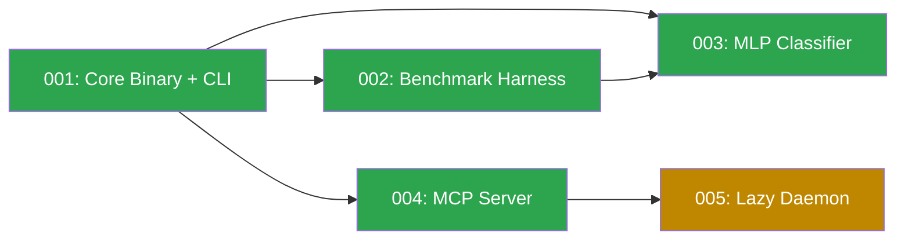

# Spec Dependency Graph

## Status

| Spec | Status | Description |
|------|--------|-------------|
| 001 | done | Core binary with CLI, REST daemon, config, reference sets, embedding cache |
| 002 | done | Benchmark harness — 12-model comparison, datasets, accuracy/latency measurement |
| 003 | done | MLP classifier — 2-layer neural network on embeddings + cosine features |
| 004 | done | MCP stdio server — 4 tools (classify, list_sets, embed, similarity) |
| 005 | ready | Lazy auto-starting background daemon — unix socket, idle timeout, fast CLI |

## Ready Now

- **005-lazy-daemon**: Implementation complete, pending quality gates

## Critical Path

001 → 004 → 005 (daemon depends on MCP architecture changes)

## Dependency Details

| From → To | Why | Blocker |
|-----------|-----|---------|
| 002 → 001 | Benchmark uses EmbeddingEngine, ModelChoice, classify_text from core | — |
| 003 → 001 | MLP classifier extends the classification pipeline | — |
| 003 → 002 | Benchmark validates MLP accuracy gains (96.2% target) | — |
| 004 → 001 | MCP server wraps the core classification/embedding engine | — |
| 005 → 004 | Daemon adds unix socket transport alongside MCP stdio | — |
