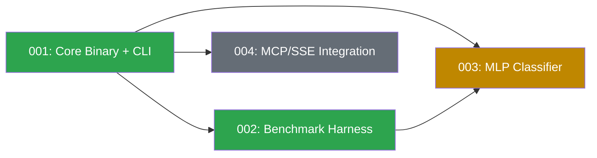

# Spec Dependency Graph

## Status

| Spec | Status | Description |
|------|--------|-------------|
| 001 | done | Core binary with CLI, REST daemon, config, reference sets, embedding cache |
| 002 | done | Benchmark harness — 12-model comparison, datasets, accuracy/latency measurement |
| 003 | ready | MLP classifier — 2-layer neural network on embeddings + cosine features |
| 004 | future | MCP/SSE integration for Claude Code agent access |

## Ready Now

- **003-mlp-classifier**: All dependencies met (001 core binary, 002 benchmark for validation)

## Critical Path

001 → 002 → 003 (MLP needs benchmark to validate accuracy improvements)

## Dependency Details

| From → To | Why | Blocker |
|-----------|-----|---------|
| 002 → 001 | Benchmark uses EmbeddingEngine, ModelChoice, classify_text from core | — |
| 003 → 001 | MLP classifier extends the classification pipeline | — |
| 003 → 002 | Benchmark validates MLP accuracy gains (96.2% target) | SC-003/SC-004 unvalidated (T025) |
| 004 → 001 | MCP/SSE adds a protocol to the existing daemon | — |
